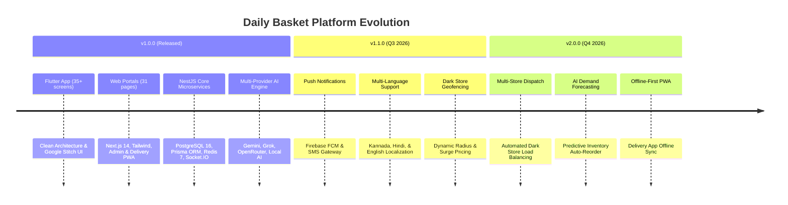

# Daily Basket — Product & Engineering Roadmap

This roadmap outlines past accomplishments, current features, and planned engineering milestones for the **Daily Basket** quick-commerce platform.

---

## 🎯 Release Milestones

---

## ✅ Implemented Features (v1.0.0)

### 📱 Customer Mobile App (`apps/mobile`)
- [x] Phone OTP login, Email/Password, Google OAuth, TOTP MFA, Biometric login.
- [x] Home feed with hero 10-minute delivery ETA bar, address selector, flash deals carousel.
- [x] Smart debounced catalog search with brand aliases and category filtering.
- [x] Cart drawer with free delivery progress meter, coupon system (`DAILY100`), slot selection.
- [x] Razorpay payment gateway integration (UPI, Cards, NetBanking, COD).
- [x] Live GPS tracking with animated progress timeline, WebSocket telemetry, driver contact.
- [x] Daily Basket Wallet ledger, instant refill, and Daily Basket Plus VIP membership screen.
- [x] Camera package freshness inspector and voice search powered by backend AI.

### 🌐 Customer Web Portal (`apps/website`)
- [x] Next.js 14 App Router portal with TailwindCSS dark mode theme.
- [x] Full catalog explorer, search filters, wishlist, active order map tracker.
- [x] Account security hub, active session device management, 2FA settings.

### 🏢 Store Admin Dashboard (`apps/admin`)
- [x] Real-time dark store fulfillment dispatch queue (`NEW` → `CONFIRMED` → `PACKING` → `DELIVERED`).
- [x] Inventory stock manager, low-stock threshold alerts, SKU search, catalog editor.
- [x] Sales KPI overview, average dispatch latency metrics, customer satisfaction reporting.

### 🛵 Delivery Partner PWA (`apps/delivery`)
- [x] Duty switch (`ONLINE`/`OFFLINE`) with continuous background GPS broadcast.
- [x] Active orders queue with store pickup details, dropoff coordinates, item manifest.
- [x] Doorstep OTP verification (`4821`) before marking orders delivered.
- [x] Earnings ledger breakdown (base pay + incentives + order count).

### ⚙️ Backend Microservices (`services/api`)
- [x] NestJS API Gateway with JWT rotation, RBAC guards, Helmet, Throttler rate limiting.
- [x] PostgreSQL 16 database managed via Prisma ORM 5.
- [x] Multi-provider LLM engine (Gemini primary, Grok/OpenRouter/Local failover).
- [x] Razorpay payment integration with HMAC SHA-256 signature verification.
- [x] Redis 7 caching, BullMQ job queues, dual Socket.IO gateways.

---

## 🔮 Upcoming Milestones

### 🔔 v1.1.0 — Push Notifications & Multi-Language
- [ ] Integration of Firebase Cloud Messaging (FCM) for instant push alerts.
- [ ] Multi-language support (Kannada, Hindi, English) across Mobile and Web applications.
- [ ] Geofenced dark store radius mapping and dynamic surge pricing calculator.

### 🤖 v2.0.0 — Automated Dispatch & AI Inventory
- [ ] Multi-store dark store dispatch load-balancing engine.
- [ ] AI-driven predictive inventory demand forecasting and auto-reorder engine.
- [ ] Offline-first sync for Delivery Partner PWA during poor network connectivity.
