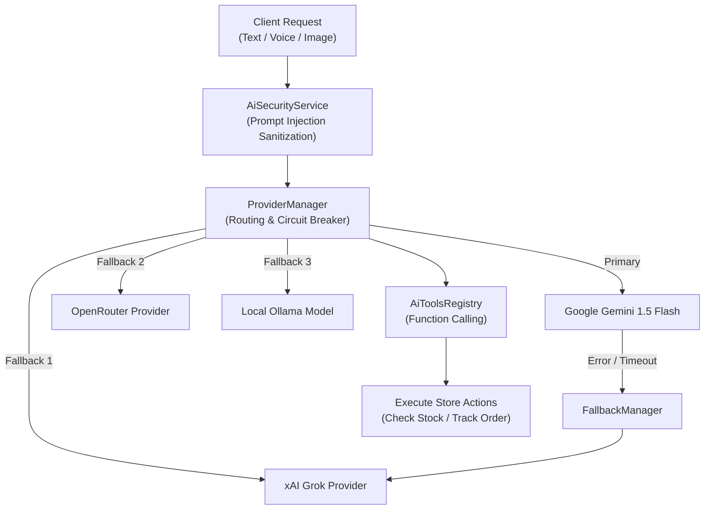

# 🤖 Multi-Provider AI Engine Architecture (`services/api/src/modules/ai`)

Daily Basket features a production multi-provider AI engine located in `services/api/src/modules/ai`. It powers natural language customer support, recipe recommendations, voice search input, and produce freshness camera scanner.

---

## 1. Provider Failover Manager Architecture

The AI module manages multiple LLM providers with automatic health monitoring, retries, and fallback routing:

---

## 2. Implemented AI Components

- **`ProviderManager`**: Manages provider selection, active health checks (`health.checker.ts`), and request dispatching.
- **`FallbackManager`**: Automatically switches providers if the primary model returns a 5xx error or times out after 3 seconds.
- **`AiSecurityService`**: Sanitizes prompt inputs against prompt injection and data leaks.
- **`AiToolsRegistry`**: Registers executable store functions for LLM function calling (e.g. `checkInventoryStock`, `getOrderStatus`).
