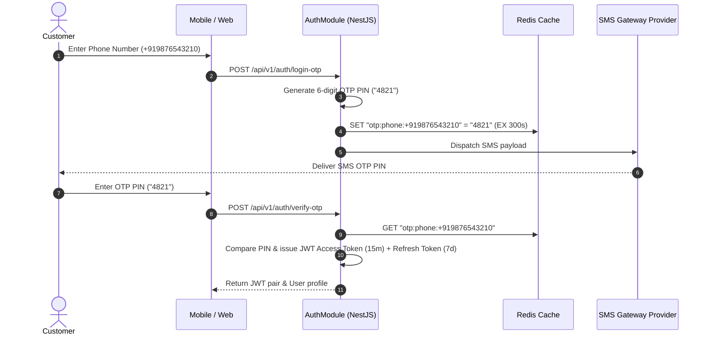

# 🔐 Authentication Architecture & Flow Reference — Daily Basket

Daily Basket implements a multi-tier authentication system supporting Phone OTP verification, Email/Password login, Google OAuth 2.0, TOTP Multi-Factor Authentication (MFA), and Biometric web login.

---

## 1. Phone OTP Verification Flow

---

## 2. JWT Access & Refresh Token Rotation

- **Access Token**: Short-lived JWT (15 minutes) signed with `JWT_SECRET`. Carries user ID, phone number, and RBAC `role`.
- **Refresh Token**: Long-lived token (7 days) stored securely in `DeviceSession` database model. Rotated upon re-issuance.

---

## 3. Account Lockout & Password Security

- **Account Lockout**: After 5 consecutive failed login attempts, the account is locked for 30 minutes (`lockoutUntil`).
- **Password Hashing**: Passwords are hashed using `bcrypt` with salt rounds = 10 (`password-policy.service.ts`).
- **Multi-Factor Auth**: Supports TOTP authenticator apps (`totp.service.ts`) with backup recovery codes.
