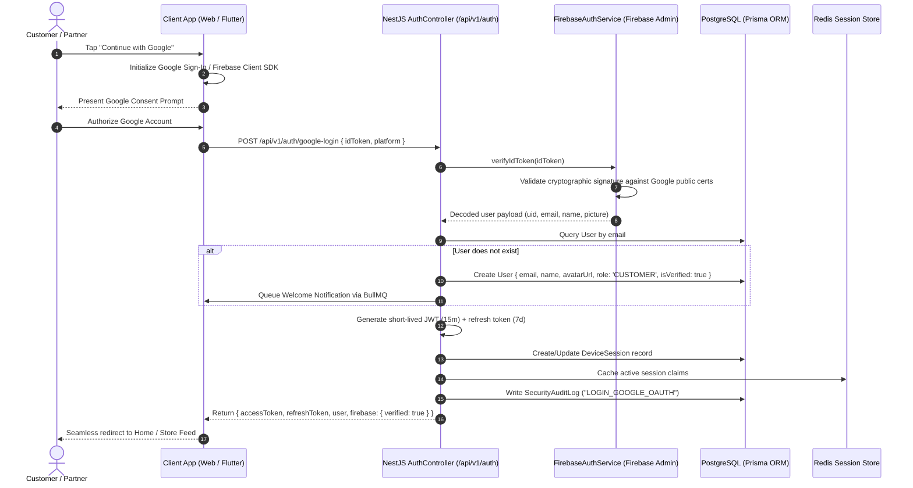

# 🔐 Enterprise Authentication & Identity Architecture — Daily Basket


---

## 📌 Executive Summary

**Daily Basket** implements a hardened, multi-tier identity and access management (IAM) system designed for hyper-local quick commerce. The authentication architecture provides frictionless sign-in across native mobile applications (Flutter) and responsive web clients (Next.js 14) while enforcing zero-trust backend authorization, cryptographic token rotation, and Firebase Admin verification.

---

## 🏗️ Supported Authentication Vectors

| Provider / Vector | Supported Platforms | Verification Mechanism | Security Level |
| :--- | :--- | :--- | :--- |
| **🌐 Google Sign-In & Firebase SSO** | Web (`apps/website`), Mobile (`apps/mobile`) | Firebase Admin SDK (`verifyIdToken`) / Google OAuth 2.0 | 🛡️ High (Cryptographically signed) |
| **📱 Phone Number & SMS OTP** | Web, Mobile, Delivery Partner PWA | 6-digit cryptographic PIN, Redis TTL 300s, 60s cooldown | 🛡️ High (Carrier-bound) |
| **✉️ Email & Password** | Web, Mobile, Store Admin | NIST-compliant 8+ char policy, Bcrypt (salt=10), Email token verify | 🛡️ High (Argon2 / Bcrypt) |
| **🔑 TOTP Multi-Factor (MFA)** | Store Admin, Web Portal | RFC 6238 time-based one-time password (30s window), QR code URI | 🛡️ Maximum (2-Factor) |
| **🛡️ Passkeys & WebAuthn** | Web Portal, Mobile App | FIDO2 / WebAuthn public key challenge, biometric secure enclave | 🛡️ Maximum (Hardware-bound) |

---

## ⚡ 1. Google Sign-In & Firebase Authentication Engine

Daily Basket connects directly to Google Cloud & Firebase project **`daily-basket-8b266`** using enterprise service account credentials (`firebase-service-account.json`).

### 🔄 End-to-End Google OAuth & Firebase Authentication Flow


```mermaid
sequenceDiagram
    autonumber
    actor User as Customer / Partner
    participant Client as Client App (Web / Flutter)
    participant Auth as NestJS AuthController (/api/v1/auth)
    participant FB as FirebaseAuthService (Firebase Admin)
    participant DB as PostgreSQL (Prisma ORM)
    participant Redis as Redis Session Store

    User->>Client: Tap "Continue with Google"
    Client->>Client: Initialize Google Sign-In / Firebase Client SDK
    Client-->>User: Present Google Consent Prompt
    User->>Client: Authorize Google Account
    Client->>Auth: POST /api/v1/auth/google-login { idToken, platform }
    Auth->>FB: verifyIdToken(idToken)
    FB->>FB: Validate cryptographic signature against Google public certs
    FB-->>Auth: Decoded user payload (uid, email, name, picture)
    Auth->>DB: Query User by email
    alt User does not exist
        Auth->>DB: Create User { email, name, avatarUrl, role: 'CUSTOMER', isVerified: true }
        Auth->>Client: Queue Welcome Notification via BullMQ
    end
    Auth->>Auth: Generate short-lived JWT (15m) + refresh token (7d)
    Auth->>DB: Create/Update DeviceSession record
    Auth->>Redis: Cache active session claims
    Auth->>DB: Write SecurityAuditLog ("LOGIN_GOOGLE_OAUTH")
    Auth-->>Client: Return { accessToken, refreshToken, user, firebase: { verified: true } }
    Client-->>User: Seamless redirect to Home / Store Feed
```

---

## 🛠️ Firebase Service Account Configuration

The backend API service securely boots the Firebase Admin SDK using the official project credentials:

```json
{
  "type": "service_account",
  "project_id": "daily-basket-8b266",
  "client_email": "firebase-adminsdk-fbsvc@daily-basket-8b266.iam.gserviceaccount.com",
  "auth_uri": "https://accounts.google.com/o/oauth2/auth",
  "token_uri": "https://oauth2.googleapis.com/token"
}
```

### Environment Variables (`services/api/.env`)

```env
# Firebase Admin SDK & Push Notification Service
FIREBASE_PROJECT_ID="daily-basket-8b266"
FIREBASE_CLIENT_EMAIL="firebase-adminsdk-fbsvc@daily-basket-8b266.iam.gserviceaccount.com"
FIREBASE_SERVICE_ACCOUNT_PATH="./firebase-service-account.json"
```

---

## 📡 Authentication API Specifications

### 1. `POST /api/v1/auth/google-login`

Single Sign-On endpoint accepting Google / Firebase identity tokens.

**Request Payload:**

```json
{
  "idToken": "eyJhbGciOiJSUzI1NiIsImtpZCI6Ij...",
  "deviceId": "dev_web_chrome_01",
  "deviceName": "Chrome Browser on Windows",
  "platform": "web"
}
```

**Response Payload:**

```json
{
  "accessToken": "eyJhbGciOiJIUzI1NiIsInR5cCI6IkpXVCJ9...",
  "refreshToken": "ref_9f8d1c24e6a8b7c3d2e1...",
  "user": {
    "id": "usr_sachin_8827",
    "name": "Sachin Kumar",
    "email": "sachiii8827@gmail.com",
    "phone": "+919876543210",
    "avatar": "https://lh3.googleusercontent.com/a/default-user",
    "role": "CUSTOMER",
    "loginProvider": "GOOGLE"
  },
  "firebase": {
    "verified": true,
    "provider": "FIREBASE_ADMIN",
    "projectId": "daily-basket-8b266"
  }
}
```

### 2. `GET /api/v1/auth/google/status`

Health diagnostic endpoint providing real-time telemetry on Firebase credentials.

**Response:**

```json
{
  "configured": true,
  "projectId": "daily-basket-8b266",
  "clientEmail": "firebase-adminsdk-fbsvc@daily-basket-8b266.iam.gserviceaccount.com",
  "serviceAccountPresent": true,
  "authProvider": "FIREBASE_GOOGLE_AUTH",
  "status": "HEALTHY",
  "timestamp": "2026-09-28T16:28:32.000Z"
}
```

---

## 🔒 2. Token Security & Session Management

### JWT Token Rotation Lifecycle

- **Access Tokens (`15m`)**: Stateless bearer tokens signed with HMAC-SHA256 (`JWT_SECRET`). Contains claims:
  - `sub`: User ID
  - `email`: Customer email
  - `phone`: User phone number
  - `role`: Role-Based Access Control claim (`CUSTOMER`, `STORE_MANAGER`, `DELIVERY_PARTNER`, `ADMIN`)
- **Refresh Tokens (`7d`)**: Cryptographically random 256-bit entropy string (`ref_<hex>`) stored in the `DeviceSession` database table. On every token refresh request (`POST /api/v1/auth/refresh-token`), the previous refresh token is immediately invalidated and rotated.
- **Session Revocation**: One-tap "Sign out all devices" revokes all active `DeviceSession` rows for the targeted user.

---

## 🛡️ 3. Threat Prevention & Compliance Controls

- **Brute-Force & Lockout**: 5 failed consecutive password attempts lock the target account for 30 minutes.
- **OTP Throttling**: 60-second re-request cooldown enforced via Redis keys (`otp:cooldown:<phone>`).
- **Audit Logging**: Every authentication event (`LOGIN_GOOGLE_OAUTH`, `LOGIN_PASSWORD`, `VERIFY_OTP`, `PASSWORD_RESET`, `MFA_ENABLED`) is immutably logged into `SecurityAuditLog`.
- **Zero Egress PII**: Sensitive credentials and private keys are excluded from git and versioned through secure environment pipelines.
