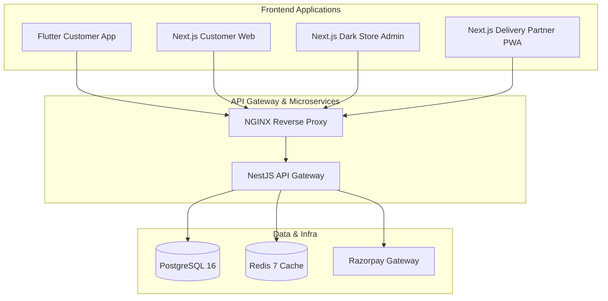

# Monorepo & System Architecture — Daily Basket

---

## Clean Architecture Layers (NestJS Backend)

1. **Domain Layer**: Core business models & entities (`prisma/schema.prisma`).
2. **Application Layer**: Business logic services (`orders.service.ts`, `payments.service.ts`, `delivery.service.ts`).
3. **Infrastructure Layer**: Database connectors (`prisma.service.ts`), Redis cache (`redis.service.ts`), third-party SDKs (Razorpay, S3 uploads).
4. **Presentation Layer**: REST API controllers with OpenAPI annotations (`orders.controller.ts`, `payments.controller.ts`).
