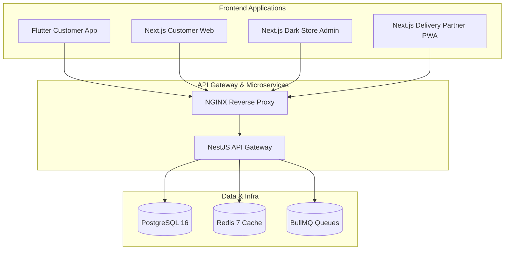

# Monorepo & System Architecture — Daily Basket

> **Authoritative Specification**: Please refer to the primary architecture document at [`docs/ARCHITECTURE.md`](../ARCHITECTURE.md) and system design document at [`docs/SYSTEM_DESIGN.md`](../SYSTEM_DESIGN.md).

