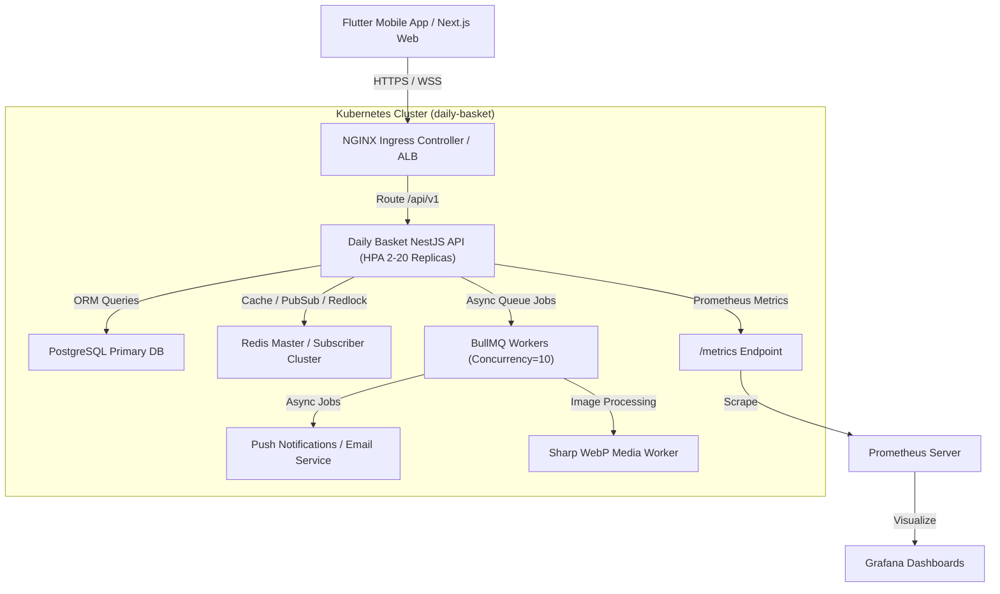
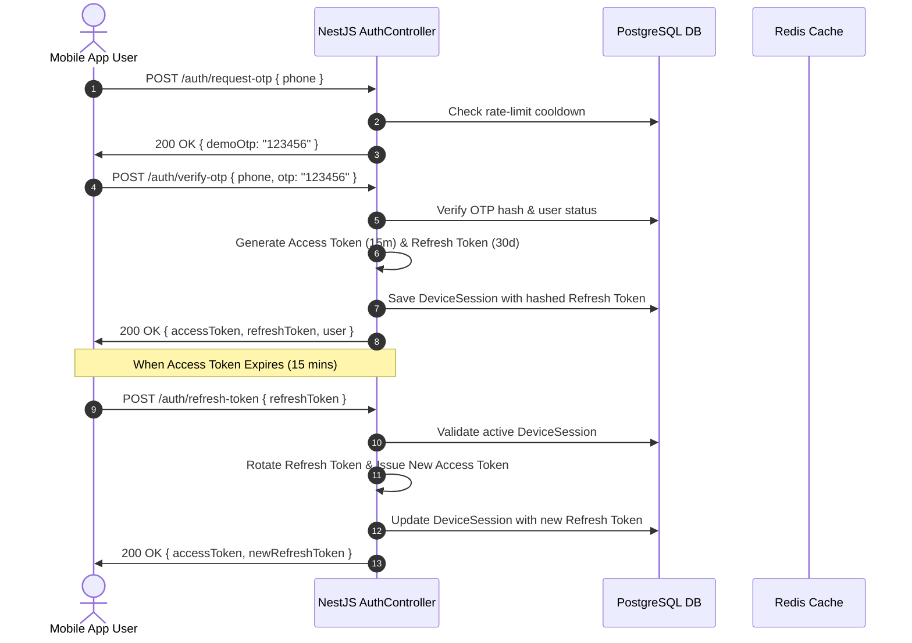
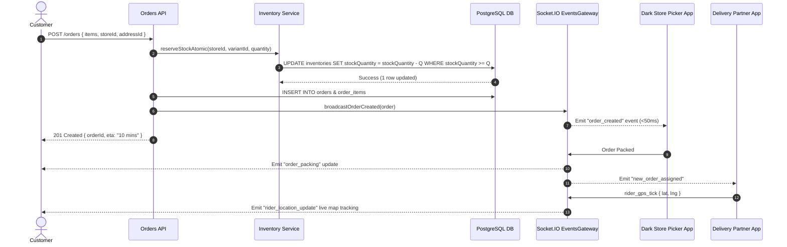
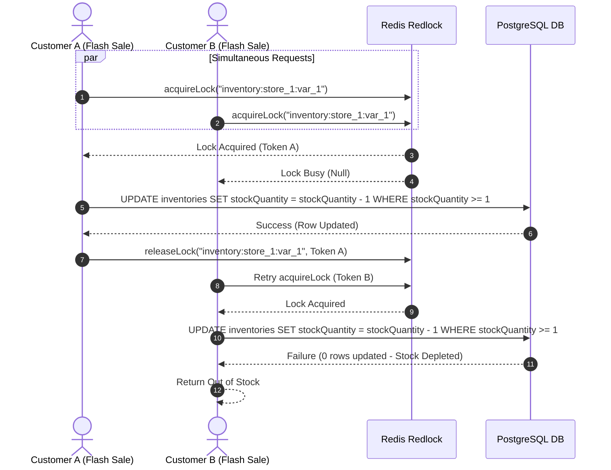

# Daily Basket — System Architecture & Flow Diagrams

## 1. High-Level System Architecture & Component Diagram

---

## 2. Authentication & JWT Token Rotation Sequence

---

## 3. 10-Minute Quick-Commerce Order Fulfillment Sequence

---

## 4. Atomic Inventory Locking & Concurrency Control Sequence

