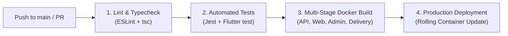

# 🚀 DevOps & CI/CD Engineering — Daily Basket

This document describes the GitHub Actions continuous integration and continuous deployment (CI/CD) pipelines configured in `.github/workflows/`.

---

## 1. Automated Pipeline Workflow

