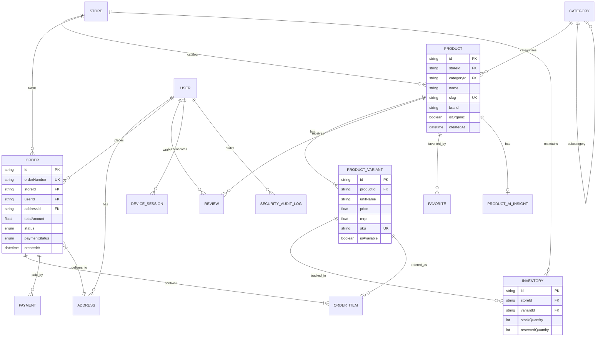

# Daily Basket — Database Schema & Entity-Relationship Diagram (ERD)

## Overview

The Daily Basket database layer is built on PostgreSQL, managed via Prisma ORM (`prisma/schema.prisma`). It enforces strict relational integrity, UUID primary keys, and performance indexing.

---

## Entity-Relationship Diagram (ERD)



---

## Database Indexing Strategy

To guarantee **<250ms database latency**, key indexes are defined across high-traffic models:

| Table | Index Columns | Purpose |
| :--- | :--- | :--- |
| `orders` | `(userId, status)` | Fast user order history lookup |
| `orders` | `(storeId, status)` | Dark store order fulfillment queue |
| `orders` | `(createdAt)` | Time-series order analytics |
| `products` | `(storeId, categoryId)` | Store category product listing |
| `products` | `(brand)` | Brand filter queries |
| `product_variants` | `(productId, isAvailable)` | Active variant fetching |
| `inventories` | `(storeId, variantId)` | Atomic stock lookup |
| `inventories` | `(stockQuantity)` | Low stock monitoring alerts |
| `reviews` | `(productId, rating)` | Product rating aggregation |
| `security_audit_logs` | `(userId, event, createdAt)` | Security audit timeline |

---

## High-Concurrency Atomic Operations

Stock allocations avoid read-modify-write race conditions by executing atomic SQL updates directly:

```sql
UPDATE inventories
SET "stockQuantity" = "stockQuantity" - $1,
    "reservedQuantity" = "reservedQuantity" + $1,
    "updatedAt" = NOW()
WHERE "storeId" = $2
  AND "variantId" = $3
  AND "stockQuantity" >= $1;
```
