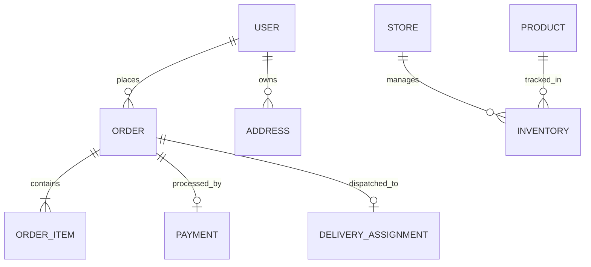

# Database Schema & Entity Relationship Overview — Daily Basket

**Database Engine**: PostgreSQL 16  
**ORM**: Prisma ORM 5  
**Schema File**: `services/api/prisma/schema.prisma`

---

## Key Entities & Relations

### Core Table Definitions
- `User`: Stores customer, store manager, and delivery partner authentication credentials and roles (`CUSTOMER`, `STORE_MANAGER`, `DELIVERY_PARTNER`, `ADMIN`).
- `Product`: Catalog items with pricing, category ID, unit name, and image URL.
- `Inventory`: Real-time stock levels (`stockQuantity`, `reservedQuantity`, `lowStockThreshold`) per dark store hub.
- `Order`: Order header with total price, delivery fee, platform fee, applied coupon discount, delivery address ID, and status (`CREATED`, `CONFIRMED`, `PACKING`, `READY_FOR_PICKUP`, `OUT_FOR_DELIVERY`, `DELIVERED`).
- `Payment`: Transaction record with Razorpay Order ID (`rzp_order_*`), status (`PENDING`, `SUCCESS`, `FAILED`), and payment method (`UPI`, `CARD`, `NETBANKING`, `COD`).
