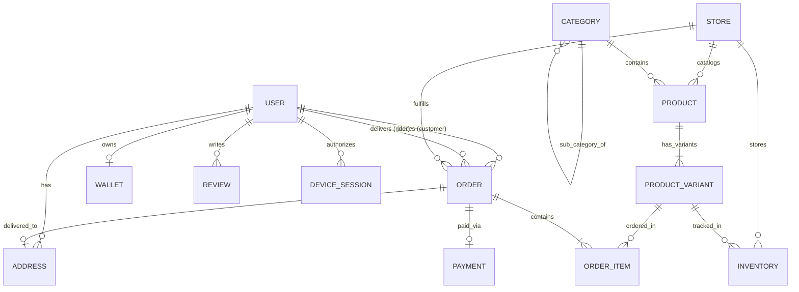
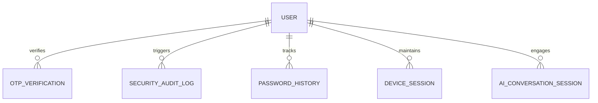

# 📊 Entity Relationship Diagram (ERD) — Daily Basket

This document provides visual Entity-Relationship Diagrams (ERD) illustrating the relational model of PostgreSQL 16 managed via Prisma ORM 5.

---

## 1. Core Domain ERD

---

## 2. Security & Session Subsystem ERD

