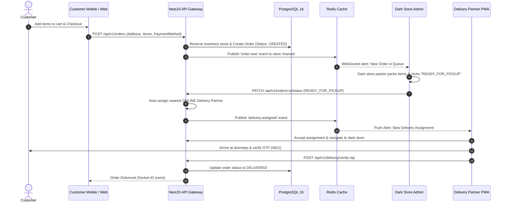

# 🧩 System Design & Data Flow — Daily Basket

This document details the low-level design patterns, data pipelines, caching strategies, state management, and real-time synchronization flows within **Daily Basket**.

---

## 1. 10-Minute Fulfillment Data Pipeline

The core product promise of Daily Basket is 10-minute doorstep delivery. The system design ensures zero-latency cart calculation and real-time dark store dispatch:

---

## 2. Caching Strategy & Redis Key Namespaces

To maintain sub-30ms API response latency, Daily Basket uses Redis 7 as an in-memory write-through and read-aside cache:

| Namespace | Key Pattern | TTL | Usage |
| :--- | :--- | :--- | :--- |
| **Catalog** | `catalog:home-feed` | 5 minutes | Home page deals, top categories, trending banners |
| **Product** | `product:slug:<slug>` | 1 hour | Individual product detail page data |
| **Store Inventory** | `inventory:store:<storeId>:variant:<variantId>` | Real-time write-through | Available vs Reserved inventory quantity |
| **User Session** | `session:token:<token>` | 7 days | Active JWT refresh token validation |
| **OTP Store** | `otp:phone:<phoneNumber>` | 5 minutes | 6-digit phone verification OTP PIN |
| **Rider GPS** | `rider:location:<riderId>` | 10 seconds | Live rider latitude & longitude coordinates |

---

## 3. Client State Management Matrix

- **Flutter Mobile App**: Uses `Provider` pattern with scoped StateProviders (`CartProvider`, `UserProvider`, `TrackingProvider`, `WalletProvider`). State changes trigger animated rebuilds.
- **Next.js Web Portal**: Combines `@tanstack/react-query` for server-state caching and synchronization with `zustand` for client UI state (cart drawer toggle, address selector modal).
- **Dark Store Admin Dashboard**: Uses `zustand` to manage real-time fulfillment stream state updated via Socket.IO WebSocket subscriptions.
