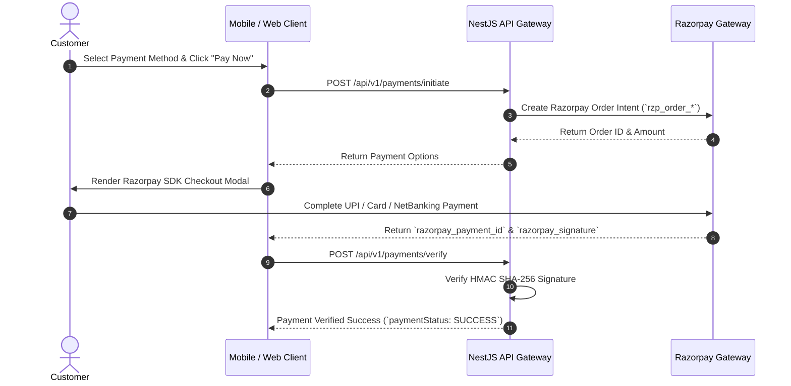

# 💳 Payments & Wallet Integration — Daily Basket (`docs/features/PAYMENTS.md`)

This document describes the Razorpay payment gateway integration, HMAC SHA-256 signature verification, and Daily Basket Wallet ledger.

---

## 1. Razorpay Payment Flow

---

## 2. Digital Wallet Ledger

- **Daily Basket Wallet**: Users can store funds, apply instant refunds, and complete one-tap checkout.
- **Transactions**: Every credit and debit operation is logged with a transaction reference ID and timestamp.
